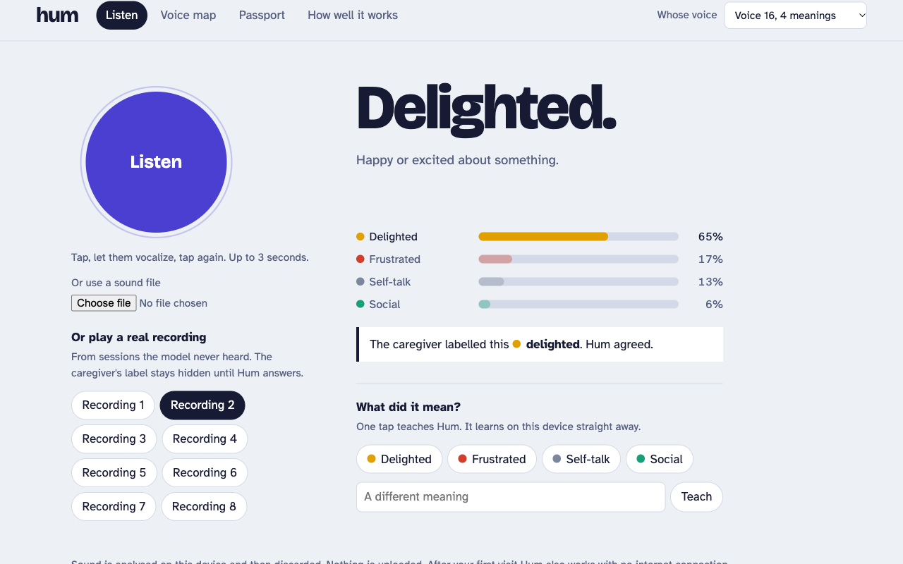

# Hum

**A personal interpreter for nonverbal vocalizations.**

Some people communicate with sounds instead of words: many autistic people, and
people with cerebral palsy or certain genetic conditions. A parent knows that one
sound means "I want that" and another means "too loud, get me out". A new
teacher, a substitute nurse, or a babysitter does not, and needs get missed.

Hum learns one person's sounds from the people who know them, then helps
everyone else. It runs entirely in the browser. Audio never leaves the device.

Built for the ML Empowerment Build Challenge 3.0.

**Live demo:** https://maanavkrishna.github.io/hum-interpreter/



## What it does

| | |
|---|---|
| **What kind of sound** | A second model names the sound itself: laugh, cry, scream, cough, sneeze, sniff, sigh, throat clearing, yawn, breathing, or other voice. 90% accurate on 4,703 held-out clips. This is the part that is not guesswork. |
| **Patterns** | "Past cries from Voice 16 meant frustrated 45 of 84 times." Learned from caregiver labels, shown with every answer and in the passport. |
| **Daily log** | While listening, Hum counts sounds by type (for example 3 coughs, 2 cries today) and saves the log as a spreadsheet for a doctor or therapist. |
| **Listen** | Tap, let the person vocalize, tap again. Hum answers with the likely meaning. |
| **Honest answers** | Hum returns a *set* of meanings sized by conformal prediction. One meaning when it is sure, two when torn, "maybe" when it is not. It does not bluff. |
| **Keep listening** | Hands-free mode: Hum picks out each sound on its own and keeps a strip of what it just heard. |
| **Upset alert** | Raised when two or more sounds in 45 seconds lean upset. Dependable for three of the eight voices (about 7 in 10 upset sounds caught, under 5% false alarms); the passport says when it is not. Caregivers choose which meanings count. |
| **Teach** | One tap on the right meaning updates that person's model on the spot. No server, no retraining. |
| **Start a new voice** | Teach Hum any voice from zero, including your own. Three examples per meaning are enough to try it; accuracy keeps improving with more. |
| **Voice map** | Every sound of one person, laid out by similarity and coloured by meaning. |
| **Hand-off file** | Save a taught voice as a 4 KB file and load it on another device, so the parent teaches once and the sitter's phone understands. The file holds embeddings, not audio. |
| **Works offline** | After one visit the app, model, and sample recordings are cached; Hum then runs with no connection. |
| **Passport** | A printable page for a new caregiver: each meaning, example sounds, what helps, and how far to trust Hum on it. |
| **How well it works** | The full evaluation, including the parts that are unflattering. |

## Run it locally

```bash
python serve.py
```

Then open http://localhost:8765. No build step. The trained model
(`web/model/hum.onnx`, 5.7 MB) and sample clips are in the repository.

## How it works

1. **Raw audio in.** 16 kHz mono, 3 seconds (short sounds are tiled, long ones cropped).
2. **Front end inside the network.** The log-mel spectrogram is computed by fixed
   convolutions holding a windowed Fourier basis, so the exported ONNX file takes
   raw samples. The browser does no signal processing, and its features match
   training to within 2e-7.
3. **Encoder.** A 1.2 M-parameter CNN trained on ReCANVo with cross-entropy over
   (person, meaning) classes plus a supervised contrastive loss, with waveform and
   spectrogram augmentation. Output: a 128-number description of the sound.
4. **Personal head.** Each meaning is the mean of its examples' embeddings.
   Classifying is a cosine similarity; teaching is adding one vector. That is
   what makes learning on the device instant.
5. **Conformal calibration.** Per person, a threshold is fit on sessions held out
   from all training, so the set of meanings Hum offers contains the right one at
   a chosen rate. For voices taught in the browser, the same threshold is
   re-derived by leave-one-out over the taught examples.

## Results

### What kind of sound (objective layer)

Trained on VocalSound, Nonspeech7k and EmoGator; tested on 4,703 clips from
people and recordings held out by the datasets' authors (`soundtypes.py`).

| Sound | Named correctly |
|---|---|
| laugh | 95% |
| sniff | 93% |
| sigh | 92% |
| sneeze | 92% |
| other voice | 92% |
| cough | 91% |
| scream | 90% |
| throat clearing | 85% |
| breathing | 82% |
| cry | 78% |
| yawn | 54% |

Accuracy 90.3%, macro-F1 0.87. On VocalSound's own test set: 91.4%, against the
authors' published baseline of 90.6% with a larger model. The ReCANVo voices have
no sound-type labels, so on them this layer is unmeasured. Adding the sound type
to the meaning hint raised five-fold macro-F1 from 0.34 to 0.35 and made no voice worse.

### What it means (personal layer)

<!-- results:start -->
Scored on 2244 vocalizations from recording sessions held out per person. Macro-F1, mean over eight people.

| Model | Macro-F1 |
|---|---|
| Always guess the commonest | 0.15 |
| MFCC + logistic regression | 0.30 |
| voc2vec (nonverbal-vocalization model), frozen | 0.31 |
| DistilHuBERT, frozen | 0.32 |
| wav2vec 2.0 base, frozen | 0.33 |
| Whisper-tiny encoder, frozen | 0.34 |
| **Hum, never heard this person** | 0.34 |
| **Hum** | 0.38 |
| MFCC, sessions mixed (inflated) | 0.47 |

Hum's plain accuracy is 0.50. The last row is not a real result: it is the MFCC model scored with sessions mixed across train and test, shown to quantify the leakage that session-aware splitting removes.

| Voice | Meanings | Test sounds | Majority | MFCC | Hum | Hum, person unseen |
|---|---|---|---|---|---|---|
| P01 | 4 | 436 | 0.18 | 0.20 | 0.43 | 0.25 |
| P02 | 4 | 183 | 0.22 | 0.19 | 0.11 | 0.22 |
| P03 | 5 | 208 | 0.17 | 0.30 | 0.45 | 0.38 |
| P05 | 5 | 272 | 0.08 | 0.51 | 0.53 | 0.52 |
| P06 | 4 | 130 | 0.16 | 0.24 | 0.35 | 0.41 |
| P08 | 5 | 720 | 0.06 | 0.28 | 0.31 | 0.18 |
| P11 | 5 | 88 | 0.15 | 0.21 | 0.23 | 0.26 |
| P16 | 4 | 207 | 0.15 | 0.46 | 0.60 | 0.46 |

Conformal prediction sets (threshold fit on calibration sessions, checked on test sessions):

| Target | Right meaning inside | Meanings offered | Single answers | Single answers correct |
|---|---|---|---|---|
| 70% | 80% | 2.6 | 30% | 72% |
| 80% | 88% | 3.2 | 17% | 83% |
| 90% | 94% | 3.8 | 4% | 89% |

Few-shot teaching (encoder never heard the person), macro-F1 by examples per meaning:

| 1 | 2 | 5 | 10 | 20 |
|---|---|---|---|---|
| 0.21 | 0.23 | 0.26 | 0.29 | 0.32 |

What did not help:

- Frozen pretrained speech encoders: best 0.34.
- Cross-session contrastive positives with per-band normalisation: 0.33.
- Uncertainty-based active learning: 0.30 after 80 labels, against 0.32 for random order.
- DistilHuBERT fine-tuned end to end (finetune.py; run stopped at epoch 8 of 12, epoch 7 chosen on calib): 0.38.
- Ensemble of three Hum encoders with different seeds (train.py seed): 0.38.
- Adding the previous sounds in the session as context (window chosen on calib): 0.38.
- Hum and frozen Whisper-tiny combined: 0.39.
- Pretraining the encoder on EmoGator, 32,130 vocal bursts, then fine-tuning (emogator.py, train.py emogator): 0.38.
- Pitch, timing and loudness-dynamics features fused with Hum (prosody.py; 0.28 on their own): 0.37.
- Rhythm of vocalising (gaps, sounds per 30 s) fused with Hum (context.py; 0.28 on its own): 0.39.
- Time of day fused with Hum (context.py): 0.33.

The last four were attempts to beat the shipped model. None moved the score past 0.39, level with Hum within noise. The limit is the data (eight people, sessions that differ more than meanings do), not the model.

**Stricter check: five-fold, session-grouped cross-validation** (`crossval.py`). Five encoders, each leaving out a different fifth of every person's sessions; all 6626 sounds scored once by an encoder that never heard their session. More meanings per person are scored than in the single split, so the task is harder.

- Macro-F1 0.34 against 0.13 for always guessing the commonest meaning (fold-to-fold spread 0.02).
- Right meaning among the top two: 69%.
- Plain accuracy 48% against 49% for the guesser: a tie. Hum's advantage is on the rarer meanings.
- Upset versus not upset, per-person AUC: 0.73 on average.
- The app's alert rule (two or more sounds in 45 s leaning upset) catches 41% of upset sounds with 5% false alarms on average, but the average hides a split:

| Voice | Meanings | Macro-F1 | Top two | Upset AUC | Upset caught | False alarms |
|---|---|---|---|---|---|---|
| P01 | 6 | 0.35 | 56% | 0.61 | 10% | 1% |
| P02 | 4 | 0.20 | 54% | 0.63 | 2% | 0% |
| P03 | 5 | 0.44 | 79% | 0.71 | 80% | 33% |
| P05 | 6 | 0.36 | 72% | 0.84 | 67% | 4% |
| P06 | 5 | 0.26 | 56% | 0.57 | 3% | 0% |
| P08 | 7 | 0.26 | 78% | 0.90 | 73% | 1% |
| P11 | 6 | 0.20 | 64% | 0.66 | 14% | 1% |
| P16 | 4 | 0.64 | 91% | 0.93 | 76% | 0% |

The cross-validated numbers are lower than the single split and are the ones to trust.

Paired bootstrap over test clips (2,000 draws). Hum macro-F1 0.38, 95% interval 0.35 to 0.40. Gap to each comparison:

| Hum minus | Gap | 95% interval |
|---|---|---|
| MFCC + logistic regression | +0.076 | +0.046 to +0.105 |
| DistilHuBERT, frozen | +0.056 | +0.028 to +0.083 |
| Whisper-tiny encoder, frozen | +0.038 | +0.009 to +0.067 |
| wav2vec 2.0 base, frozen | +0.047 | +0.020 to +0.074 |

Every interval excludes zero. Caveat: clips from one session are not independent and there are only eight people, so these intervals are narrower than the truth.
<!-- results:end -->

### Reading these numbers

- **Trust the cross-validated numbers.** The five-fold check gives macro-F1 0.34,
  lower than the single split's 0.38, and shows Hum only ties a commonest-meaning
  guesser on plain accuracy. Its gain is on the rarer meanings.
- **Telling upset from not upset is what works best**, and only for some people:
  AUC 0.84 to 0.93 for three voices, 0.57 to 0.71 for the other five.
- **This is a hard problem and the scores are modest.** Hum roughly doubles
  always-guess-the-commonest-meaning and scores above MFCC features and three
  large pretrained speech models (gaps of 0.04 to 0.08, bootstrap intervals
  excluding zero), but it is right about half the time. It is a hint.
- **Why it is hard.** Eight people, a few hundred to 1,700 clips each, labelled
  live by caregivers; the same meaning sounds different on different days.
- **Session leakage is real.** Scoring with clips from one recording on both
  sides of the split makes the same model look far better. Every headline number
  here keeps whole sessions apart.
- **Honesty is the feature.** Because accuracy is modest, the product never
  forces a single guess. When Hum commits to one meaning it is usually right;
  otherwise it says what it is choosing between.
- **A new person starts weak.** With an encoder that never heard them, one
  example per meaning gives 0.21 and twenty give 0.32. Teaching helps steadily;
  it is not instant.
- **People differ.** For some voices Hum is useful; for one (P02) it is worse than
  guessing. The passport tells the caregiver which meanings to trust.

## Limits and care

- Eight people is a small sample. Nothing here shows Hum generalises to the wider
  population.
- Hum does not diagnose anything and does not replace the people who know the
  communicator. Their read always wins.
- A wrong "content" when someone is in distress has a cost. That is why answers
  come as sets, and why the passport states reliability per meaning.
- Sample clips are real vocalizations from the public ReCANVo dataset, shared by
  families for research under CC BY 3.0 US. They are included with attribution
  and only from held-out sessions.
- Voices you teach are stored in your browser's local storage as embeddings, not
  audio.

## Repository

```
ml/model.py       encoder with convolutional log-mel front end
ml/data.py        ReCANVo loading, 16 kHz cache, session ids
ml/splits.py      session-aware train / calib / test splits
ml/baselines.py   majority and MFCC baselines, plus the leakage demonstration
ml/probe.py       frozen wav2vec 2.0, DistilHuBERT, Whisper-tiny comparison
ml/train.py       encoder training; leave-one-person-out; cross-session ablation; extra seeds
ml/finetune.py    end-to-end fine-tuning of DistilHuBERT or Whisper-tiny (did not help)
ml/attempts.json  scores of later attempts to raise accuracy
ml/evaluate.py    scoring, calibration, conformal sets, ONNX export, app bundle
ml/significance.py  paired bootstrap of Hum against each comparison model
ml/report.py      writes the results section of this file
ml/emogator.py    pretraining on the EmoGator vocal-burst corpus
ml/soundtypes.py  the sound-type model: data, training, held-out test
ml/export_types.py  ONNX export, sound-type patterns per voice, fusion check
ml/crossval.py    five-fold session-grouped cross-validation, incl. replay of the alert rule
ml/prosody.py     pitch, timing and loudness-dynamics features (did not help)
ml/context.py     time-of-day and vocal-rhythm features (did not help)
web/              the app: static files, onnxruntime-web, service worker, no backend
docs/screenshots  images for the submission
```

## Reproduce

```bash
uv venv --python 3.12 .venv && uv pip install --python .venv/bin/python -r requirements.txt transformers
mkdir -p data && curl -L -o data/ReCANVo.zip "https://zenodo.org/api/records/5786860/files/ReCANVo.zip/content"
cd data && unzip -q ReCANVo.zip && cd ../ml
../.venv/bin/python data.py          # cache audio
../.venv/bin/python baselines.py
../.venv/bin/python probe.py         # downloads three pretrained models
../.venv/bin/python train.py shipped 40
../.venv/bin/python train.py xsession 24
../.venv/bin/python train.py lopo 15
../.venv/bin/python emogator.py cache && ../.venv/bin/python emogator.py pretrain 15   # needs data/EmoGator
../.venv/bin/python crossval.py 30 && ../.venv/bin/python crossval.py score
../.venv/bin/python soundtypes.py cache && ../.venv/bin/python soundtypes.py train 20   # needs data/vocalsound, data/nonspeech7k
../.venv/bin/python export_types.py
../.venv/bin/python evaluate.py && ../.venv/bin/python significance.py && ../.venv/bin/python report.py
```

Training takes about 20 minutes for the shipped encoder and about 2 hours for
leave-one-person-out on an Apple M1 Pro.

## Credit

- **ReCANVo**: Johnson, K. T., Narain, J., Quatieri, T., Maes, P., Picard, R. W.
  "ReCANVo: A database of real-world communicative and affective nonverbal
  vocalizations." *Scientific Data* 10, 523 (2023).
  Data: https://doi.org/10.5281/zenodo.5786859, CC BY 3.0 US.
- **VocalSound**: Gong, Yu, Glass (2022), CC BY-SA 4.0. **Nonspeech7k**: Rashid et al.
  (2023), CC BY 4.0. **EmoGator**: Buhl (2023), Apache-2.0. The sound-type model
  (`web/model/types.onnx`) is trained on these and inherits VocalSound's share-alike terms.
- The idea of personalised models built from caregivers' live labels comes from
  the MIT Media Lab **Commalla** project. Hum is an independent student project
  and is not affiliated with it.
- onnxruntime-web (MIT), PyTorch, scikit-learn, librosa, Hugging Face Transformers.
- Typefaces: Atkinson Hyperlegible (Braille Institute) and Bricolage Grotesque.

Code: MIT licence.
